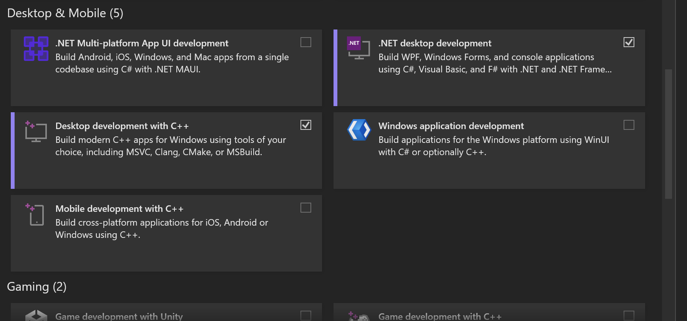

# Install Instructions for Windows (Intel VM for Macs or Native)
Use this as a troubleshooting and installation guide.

# How to Install
1. Ensure Visual Studio is installed
2. Download the `Windows-Install-Phase1.ps1` and `Windows-Install-Phase2.ps1` scripts. Save them to downloads
3. Open Powershell and run as Administrator
   1. Search for Powershell
   2. Right-click on the Powershell item
   3. Click Run as Administrator 
4. Type `cd $HOME\Downloads` to change to Downloads folder
   1. If this fails, you need to type `cd C:\Users\{YOUR_USERNAME}\Downloads`
   2. Replace {YOUR_USERNAME} with the name of your user's folder
5. Type `.\Windows-Install-Phase1.ps1`, this will begin phase 1's install
   1. You may receive an error which says you cannot execute this script due to security. Please type the following command:
      1. `Set-ExecutionPolicy RemoteSigned`
6. Close Powershell
7. Perform steps 3 and 4 again
8. Type `.\Windows-Install-Phase2.ps1`, this will finish the installation process
   1. _**Important**_ We prompt you to ask if you are on an arm-based system. If you are using **Intel**, please answer **"no"**. If you are using **ARM**, answer **"yes"** 
   2. You may receive an error stating Visual Studio is not installed. Ensure you have the C++ Desktop module installed. _See Troubleshooting_
9. If you received an error at step 5, please run `Set-ExecutionPolicy Restricted` to reset your security
   1. This ensures you cannot run a script from Powershell

# What Happens When I Run This Script?
1. We check if choco is installed
   1. If it is installed, we move on
   2. If it is _not_ installed, we install Homebrew [5 min]
2. We install PostgreSQL with choco [10-30 min]
3. We install git [1-5 min]
4. We need to restart Powershell to ensure the path has been updated
5. We check if vcpkg is installed (note: If it is not linked, this script takes it as not installed)
   1. If it is found, we move on
   2. If it is _not_ found (or linked to the command line), we download vcpkg from GitHub and install it
6. We prompt you if you are using ARM64 or Intel-based 64
7. We integrate vcpkg so linking in your Visual Studio projects is automatic with vcpkg-installed packages
8. We install libpqxx with vcpkg (This will be automatically linked with Visual Studio)
9. Everything is installed. Now download and open the project!

# Why do I Need to Run This Script?
- We need the PostgreSQL and libpqxx libraries. This is a simple way of installing them.
- It ensures you do not need to link anything in Visual Studio

# Troubleshooting

### Error: (See next line)
`error: in triplet {ARCH}-windows: Unable to find a valid Visual Studio instance`  
`Could not locate a complete Visual Studio instance`  
`The following paths were examined for Visual Studio instances:` 
`   <PATHS TO VS>` 
Solution: Ensure you have all components of Visual Studio installed:

### Unable to Run the Script in Powershell
What is happening: By default in some Windows installations, you cannot run scripts as a user for security reasons. 
How to fix: Execute `Set-ExecutionPolicy RemoteSigned` 
How to revert: Execute `Set-ExecutionPolicy Restricted` 
**Warning: If you do not revert this change, you may be at higher risk of a cyberattack. We recommend reverting to your prior state after installing this script.** 