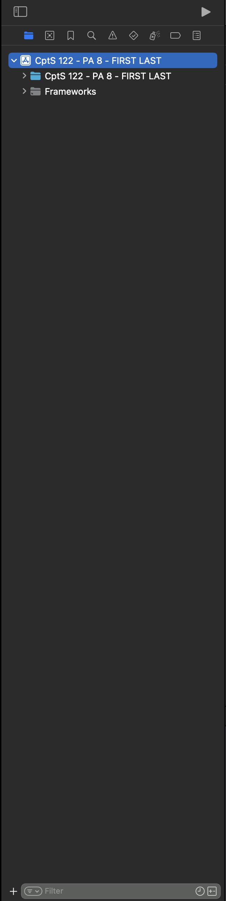
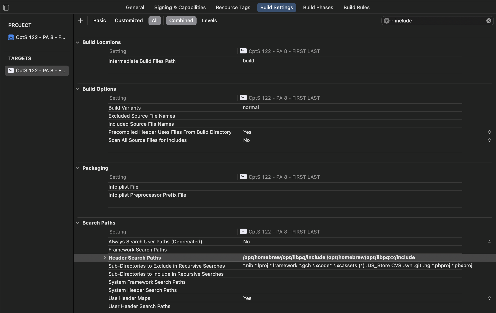
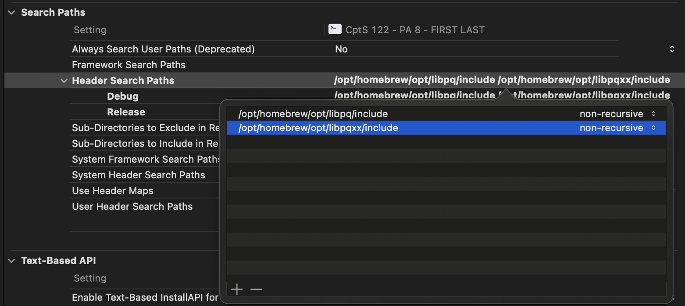
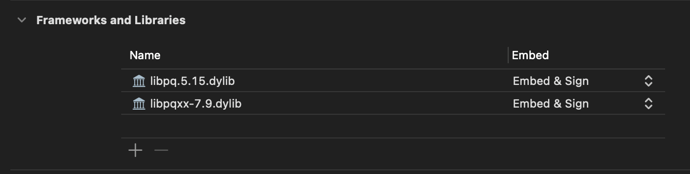

# Install Instructions for macOS (required for ARM Mac)
Use this as a troubleshooting and installation guide.

# How to Install
1. Decide if you want to use Xcode or CLion 
   1. [Download Xcode](https://developer.apple.com/xcode/)
   2. [Download CLion](https://www.jetbrains.com/clion/download/)
2. Download the macos-install.zsh file. Save this to Downloads
3. Open Terminal (/Applications/Utilities/Terminal.app)
   1. Note: the following statements will be case-sensitive
4. Change directory to Downloads: `cd Downloads`
5. Execute the script: `./macos-install.zsh`
   1. Error: `zsh: permission denied: ./macos-install.zsh` 
      Solution: `chmod +x macos-install.zsh` Then, retry step 5

# What Happens When I Run This Script?
1. We check if Homebrew is installed
   1. If it is installed, we move on
   2. If it is _not_ installed, we install Homebrew [15-30 min]
      1. **You must run this from an administrative account. When you are prompted to enter your password, enter what you use to login to your computer. _Note: You will not see characters as you type!_**
2. We use Homebrew to install PostgreSQL version 15 [10-20 min]
3. We use Homebrew to install libpqxx [15-30 min]
4. We use Homebrew to install cmake [1-10 min]
5. All done! This is a fully automated process.

# Why do I Need to Run This Script?
- We need the PostgreSQL and libpqxx libraries. This is a simple way of installing them.
- The provided Xcode and CLion projects are linked to these files.

# Troubleshooting
### Error: `zsh: permission denied: ./macos-install.zsh`
- What went wrong: The file is not executable, thus we cannot access the file with execute permissions.
- Solution: Make the script executable by running `chmod +x macos-install.zsh`

### Error: Xcode fails to compile due to a circular reference with PostgreSQL
- Solution: Clean the project (⌘ + ⇧ + K)

### Error: Xcode cannot find some headers
- Solution: Go to `Build Settings` and ensure the "Header Search Paths" are correct.
Step-by-step Instructions:
1. In the left column Select `CptS 122 - PA 8 - *`

2. In the main window, select the executable under TARGETS, then select the `Build Settings` tab.
   1. Ensure `All` is selected
3. Look for "Header Search Paths"

4. Ensure you have the correct values:
   1. For M-series Macs:
      1. /opt/homebrew/opt/libpq/include
      2. /opt/homebrew/opt/libpqxx/include
   2. For Intel-series Macs:
      1. /usr/local/opt/libpq/include
      2. /usr/local/opt/libpqxx/include
   3. For Both:
      1. Ensure they are non-recursive

5. Ensure you have the correct libraries linked

### How to: Find a file, library, or include
1. Open Terminal

**Looking for a file?**  
Type `find / -iname "NAME_OF_FILE"` 
    This will search the root folder of your device for NAME_OF_FILE ignoring case.

***ARM-Based:* Find the location of your library:** 
libpq: `find /opt/homebrew/Cellar/postgresql@15 -type f -iname "libpq.*.dylib"` 
libpqxx: `find /opt/homebrew/Cellar/libpqxx -type f -iname "libpqxx*.dylib"` 
Use the highest version you find and link it.

***Intel-based:* Find the location of your library:** 
libpq: `find /usr/local/Cellar/postgresql@15 -type f -iname "libpq.*.dylib"` 
libpqxx: `find /usr/local/Cellar/libpqxx -type f -iname "libpqxx*.dylib"` 
Use the highest version you find and link it.

